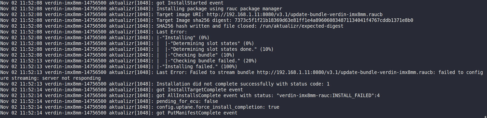
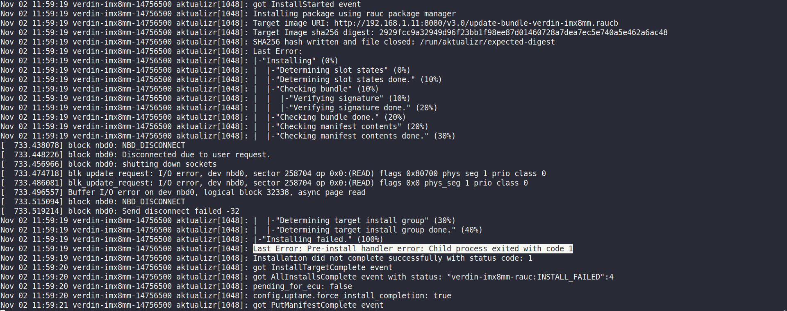
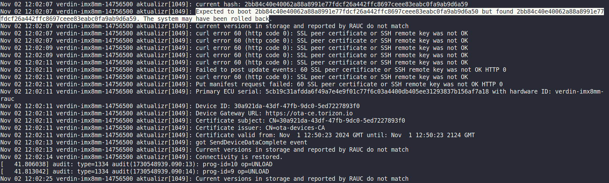

## Deliverables

1. **The final contribution is made in the following branch/PR: [link](https://github.com/uptane/aktualizr/pull/123)**
2. To run the project, follow the steps mentioned in [setup.md](./setup.md)
3. Initial GSoC proposal can be found in [gsoc-proposal.pdf](./gsoc-proposal.pdf)
4. The project presentation is present in 
5. Some scripts required to be integrated in TorizonOS image outside of the aktualizr repository for the implementation can be found in [scripts](../scripts/) directory

## Tests
1. Run without the server running

2. Wrong URL path: 

3. Wrong image digest:

4. Wrong content hash:
